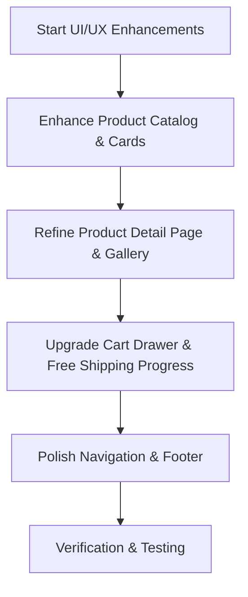

# UI/UX and Responsiveness Improvement Plan

## Overview
This plan outlines the enhancements to improve the UI/UX, responsiveness, and visual polish of the APEX Product Storefront.

## Proposed Changes

### 1. Product Catalog & Search Experience (`components/ProductCatalog.tsx` & `components/ProductCard.tsx`)
- Add responsive category pill filters with active state indicators and smooth hover transitions.
- Enhance search bar input with clear button, focus rings, and icon styling.
- Polish `ProductCard` components with subtle lift-on-hover shadows, image zoom transitions, quick add-to-cart overlay buttons, and stock status indicators.

### 2. Product Detail View (`components/ProductDetailClient.tsx` & `app/products/[slug]/page.tsx`)
- Implement a responsive image gallery switcher (thumbnail selector + main image).
- Create a sticky buy box container on desktop viewports.
- Add features breakdown list with icons (warranty, shipping, support).
- Improve related products grid responsiveness.

### 3. Cart Drawer & Checkout Experience (`components/CartDrawer.tsx`)
- Add a dynamic free shipping progress bar calculated against the $50 threshold.
- Improve item quantity stepper controls with touch-friendly sizing.
- Refine empty cart state with clear call-to-action to return to catalog.
- Smooth backdrop blur and slide-over animations.

### 4. Navigation & Footer Polish (`components/Navbar.tsx` & `components/Footer.tsx`)
- Enhance mobile menu slide-down animation and link separation.
- Add newsletter subscription form mockup in footer with success state.
- Refine typography, spacing, and micro-interactions across all breakpoints.

## Mermaid Workflow

